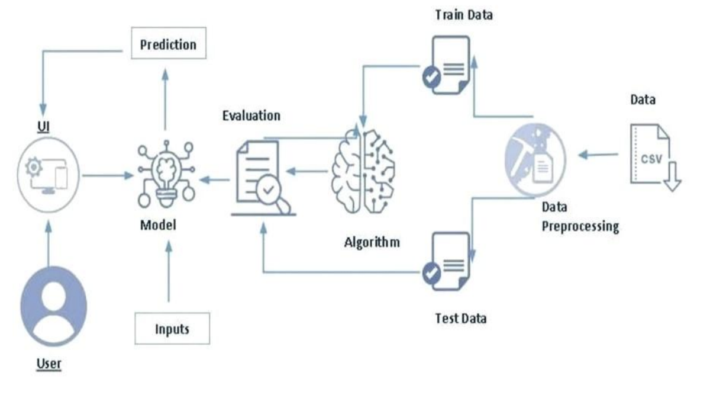
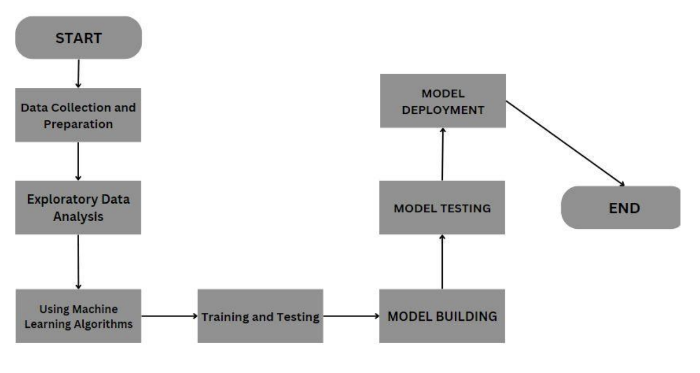

# Crop Prediction Using Machine Learning

## Overview
For farmers and other agricultural decision-makers, crop prediction is a crucial undertaking. Accurately predicting which crops would be best to grow given soil and environmental conditions can have a significant impact on agricultural profitability and productivity. 

By creating a crop forecast model that uses machine learning techniques to give farmers well-informed predictions, our study seeks to address this challenge. By examining forecasted rainfall, soil composition, and meteorological factors, this project's main goal is to help farmers choose the best crops to grow. The program can forecast which crops are most likely to flourish in a given environment by taking these characteristics into account.

## Existing System
Estimating yield and predicting crops are essential for agricultural decision-making. Traditional crop forecast methods that rely on manual analysis of historical data face accuracy and efficiency issues. To address these concerns, this project suggests a machine learning-based strategy.

The model utilizes historical data and advanced algorithms to produce precise and efficient predictions for optimal crop selection. By incorporating this model into an intuitive web application, farmers can enter parameters and get real-time crop suggestions, enhancing accessibility and usefulness. 

## Proposed System
This project proposes a machine learning-based approach for crop prediction using historical crop data and associated environmental factors. The **Random Forest Classifier** algorithm is chosen due to its efficiency in classification tasks. 

The Random Forest method builds multiple decision trees and aggregates their predictions to enhance accuracy in crop selection. The model efficiently analyzes environmental factors such as:
- Rainfall
- Soil composition
- Temperature
- Humidity
- pH level

Using these factors, the model suggests the best crop to grow in a given environment.

## System Design
**

### Software Requirements
- **Python** for programming
- **pandas** for data manipulation
- **scikit-learn** for machine learning algorithms
- **Flask** for building the web application
- **HTML, CSS, and JavaScript** for the user interface

## System Flow
**

## Results
The research successfully developed a reliable and accurate crop forecast model by analyzing historical crop yield and environmental data using machine learning techniques. The model can accurately predict the best-suited crop based on the given input parameters.

### Key Achievements
- **99% accuracy** in crop predictions
- Integration into an **intuitive web application**
- Users can enter environmental conditions and receive crop recommendations instantly

**
**
**

## Advantages
✔️ Precise crop forecasting using environmental factors and historical data  
✔️ Suggests appropriate crops, necessary fertilizers, and seed amounts  
✔️ Helps farmers choose crops that will yield a profit  

## Disadvantages
❌ Depends on past data and assumes future trends will be similar  
❌ Limited to crops included in the dataset  
❌ Requires frequent dataset updates for accurate predictions  

## Future Enhancements & Scope
- Integration of real-time meteorological data
- Expanding the crop database
- Adding disease and pest prediction capabilities
